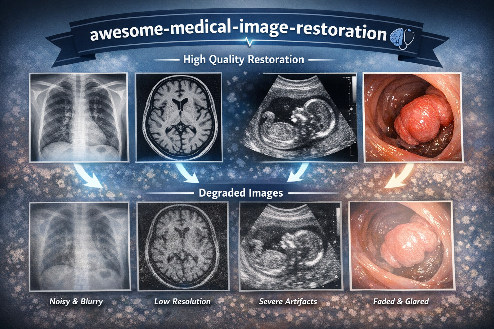

# Awesome-Medical-Image-Restoration  

**Medical Image Restoration (MedIR)** aims to recover high-quality medical images from degraded low-quality observations.

**Two Criteria for inclusion in this MedIR repository:**

- **General-purpose MedIR**: The method must be applicable to *more than one* MedIR task, demonstrated across multiple modalities or multiple degradation types within a single modality.
- **Open-source**: The code and/or data must be *publicly available* to enable reproduction of results.

## Table of Contents 

- [All-in-One MedIR](#all-in-one-medir)
  - [2024](2024) | [2025](2025)

- [Single-Task MedIR](#single-task-medir)
  - [2024](2024) | [2025](2025) 

- [Benchmarks](benchmarks)

### All-in-One MedIR

#### 2024

| Title                                                        |                             Code                             |                             Link                             | N (Modalities / Degradations) |
| :----------------------------------------------------------- | :----------------------------------------------------------: | :----------------------------------------------------------: | :---------------------------: |
| All-in-One Medical Image Restoration via Task-Adaptive Routing |  |  |             3M3D              |

#### 2025

|                            Title                             |                             Code                             |                             Link                             | N (Modalities / Degradations) |
| :----------------------------------------------------------: | :----------------------------------------------------------: | :----------------------------------------------------------: | :---------------------------: |
| TAT: Task-Adaptive Transformer for All-in-One Medical Image Restoration |  |  |             3M3D              |
| EndoIR: Degradation-Agnostic All-in-One Endoscopic Image Restoration via Noise-Aware Routing Diffusion |  |  |             1M3D              |

### Single-Task MedIR

#### 2024

|                            Title                             |                             Code                             |                             Link                             | N (Modalities / Degradations) |
| :----------------------------------------------------------: | :----------------------------------------------------------: | :----------------------------------------------------------: | :---------------------------: |
| Restore-RWKV: Efficient and Effective Medical Image Restoration with RWKV |  |  |             3M3D              |
|  Region Attention Transformer for Medical Image Restoration  |  |  |             3M3D              |

#### 2025

|                            Title                             |                             Code                             |                             Link                             | N (Modalities / Degradations) |
| :----------------------------------------------------------: | :----------------------------------------------------------: | :----------------------------------------------------------: | :---------------------------: |
| Directional Adaptive Shuffle-Based Visual State-Space Models for Medical Image Restoration |  | [MICCAI25](https://papers.miccai.org/miccai-2025/paper/0433_paper.pdf) |             3M3D              |

### Benchmarks

|                            Title                             |                             Code                             |                             Link                             | N (Modalities / Degradations) |
| :----------------------------------------------------------: | :----------------------------------------------------------: | :----------------------------------------------------------: | :---------------------------: |
| All-in-One Medical Image Restoration via Task-Adaptive Routing |  |  |             3M3D              |
| Benchmarking Endoscopic Surgical Image Restoration and Beyond |  |  |             1M3D              |
